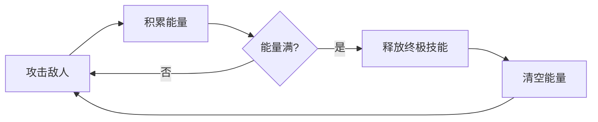

# 双锋对决 (Dual Edge Showdown)

<div align="center">


一款使用 HTML5 + JavaScript 开发的 2D 横版双人格斗网页游戏

[](LICENSE)
[](README.md)
[](README.md)

</div>

---

## 📖 简介

**双锋对决** 是一款快节奏的 2D 横版格斗游戏，提供法师与机械师两个特色角色。每个角色拥有独立的技能系统和终极技能，通过多回合对战决定胜负。游戏支持本地双人对战、用户系统、排行榜等丰富功能。

## 📑 目录

- [游戏特性](#-游戏特性)
- [快速开始](#-快速开始)
- [系统要求](#-系统要求)
- [安装与运行](#-安装与运行)
- [角色介绍](#-角色介绍)
- [操作方式](#-操作方式)
- [游戏机制](#-游戏机制)
- [数据库集成](#-数据库集成)
- [项目结构](#-项目结构)
- [技术信息](#-技术信息)
- [贡献指南](#-贡献指南)
- [更新日志](#-更新日志)
- [常见问题](#-常见问题)

## ✨ 游戏特性

| 特性 | 描述 |
|------|------|
| 🎮 双人对战 | 支持本地双人同屏对战，享受面对面竞技乐趣 |
| 🎭 独特角色 | 法师与机械师拥有完全不同的技能体系和战斗风格 |
| ⚡ 能量机制 | 通过攻击积累能量，释放强大的终极技能 |
| 🎯 多样技能 | 每个角色拥有 4 个主动技能和 1 个终极技能 |
| 🏆 回合对战 | 三局两胜制，率先赢得 2 个回合的玩家获胜 |
| 🔊 音效系统 | 完整的背景音乐和技能音效，支持音效开关控制 |
| 🗺️ 地图互动 | 包含医疗包等可互动元素，增加策略性 |
| 🎨 精美UI | 现代化的暗黑风格游戏界面设计 |
| 👤 用户系统 | 支持账户注册、登录和游戏数据云端保存 |
| 📊 排行榜 | 全球分数排行榜，与全球玩家一较高下 |

## 🚀 快速开始

### 方式一：直接运行

```bash
# 1. 克隆项目
git clone [项目仓库地址]
cd the-third--update-from-local

# 2. 用浏览器打开 index.html
```

### 方式二：本地服务器（推荐）

```bash
# 使用 Python 3
python -m http.server 8000

# 或使用 Node.js
npx serve .

# 访问 http://localhost:8000
```

### 游戏流程

1. 打开游戏后点击 **"START"** 按钮
2. 登录账户（支持邮箱密码登录）
3. 选择角色开始对战
4. 享受游戏！

## 💻 系统要求

| 类别 | 要求 |
|------|------|
| **浏览器** | Chrome 70+ / Firefox 65+ / Safari 12+ / Edge 79+ |
| **分辨率** | 推荐 1500x700 或更高 |
| **网络** | 可选（仅数据库功能需要） |
| **JavaScript** | 必须启用 |

## 📦 安装与运行

### 基础安装

```bash
# 克隆项目
git clone [项目仓库地址]
cd the-third--update-from-local
```

### 启动方式

#### 选项 1：直接打开
双击 `index.html` 文件，使用浏览器打开

#### 选项 2：本地服务器（推荐）

```bash
# Python 3
python -m http.server 8000

# Python 2
python -m SimpleHTTPServer 8000

# Node.js
npx serve .

# PHP
php -S localhost:8000
```

然后在浏览器访问：`http://localhost:8000`

### 数据库配置

如需使用完整的用户系统和数据保存功能，请配置 Supabase 数据库：

1. 访问 [Supabase 官网](https://supabase.com) 并创建免费项目
2. 复制项目的 **Project URL** 和 **API Key**
3. 在 `supabase/config.toml` 中填入配置信息
4. 在 Supabase SQL 编辑器中运行 `database/database_init.sql` 初始化脚本

> 📌 详细配置指南请参考 [docs/SUPABASE_SETUP.md](docs/SUPABASE_SETUP.md)

## 🎭 角色介绍

### 🧙 法师

> 生命值：**3800 HP** | 定位：远程控制 / 范围伤害

法师擅长使用魔法进行远程攻击，拥有强大的控制技能和大范围伤害能力。

#### 技能表

| 技能 | 按键 | 效果 | 冷却 |
|:----:|:----:|------|:----:|
| 法力凝聚 | H | 永久增加 10% 基础属性，可叠加 | 13秒 |
| 魔焰射线 | J | 向前方发射 300px 射线，造成 180 点伤害 | 0.5秒 |
| 魔障 | K | 释放 2.8 秒护盾，最多吸收 400 点伤害 | 8秒 |
| 炎爆术 | B | 蓄力火球，咏唱越久伤害越高 (50~秒杀) | 12秒 |
| 替身 ⭐ | Q | 创造替身提供 2000HP 护甲，自动攻击 | 能量满 |

#### 特殊机制
- 炎爆术咏唱期间移动速度减半
- 替身每存在 1 秒，为本体恢复 60 HP
- 替身自动投掷微型火球，每个 200 伤害 (1.5秒CD)

---

### 🤖 枪械师

> 生命值：**4000 HP** | 定位：快速机动 / 爆发输出

枪械师拥有极强的机动性和爆发能力，擅长快速打击和范围爆发。

#### 技能表

| 技能 | 按键 | 效果 | 冷却 |
|:----:|:----:|------|:----:|
| 血祭 | U | 消耗 120HP，提升 50% 属性和 100% 攻速 | 8秒 |
| 射击 | I | 向前方 200px 射击，造成 1-200 点随机伤害 | 0.3秒 |
| 突进 | O | 向前突进 4 个单位，无视碰撞 | 1.2秒 |
| 微型核弹 | P | 发射核弹，距离越远伤害越高（可蓄力） | 根据蓄力 |
| 恐怖机器人 ⭐ | L | 释放 3 个追踪机器人，接触后爆炸 | 能量满 |

#### 特殊机制
- 血祭消耗自身 120 点生命值
- 微型核弹可按住蓄力增加伤害和飞行速度
- 机器人造成 800 点爆炸伤害，可被击毁

## 🎮 操作方式

<div align="center">

| 操作 | 法师 (左侧玩家) | 枪械师 (右侧玩家) |
|:----:|:---------------:|:-----------------:|
| 向左移动 | A | ← |
| 向右移动 | D | → |
| 跳跃 | W (可二段跳) | ↑ (可二段跳) |
| 技能 1 | H (法力凝聚) | U (血祭) |
| 技能 2 | J (魔焰射线) | I (射击) |
| 技能 3 | K (魔障) | O (突进) |
| 技能 4 | B (炎爆术) | P (微型核弹) |
| 终极技能 ⭐ | Q (替身) | L (恐怖机器人) |

</div>

> 💡 **提示**：炎爆术和微型核弹可以按住蓄力，释放更强大的攻击！

## ⚙️ 游戏机制

### 能量系统



- 每次攻击都会积累能量
- 能量达到 **100%** 时可以释放终极技能
- 终极技能威力强大，但会清空所有能量

### 回合系统

- **三局两胜制**：率先赢得 2 个回合的玩家获胜
- 每回合结束后，双方角色位置互换
- 生命值会在每回合开始时完全恢复

### 地图元素

| 元素 | 位置 | 效果 |
|------|------|------|
| 💊 小医疗包 | 地图左侧 | 恢复 400 HP |
| 💉 大医疗包 | 地图右侧 | 恢复 800 HP |
| 🏔️ 地形 | 全地图 | 影响移动和跳跃 |

## 🗄️ 数据库集成

本项目集成 **Supabase** 云数据库，提供以下功能：

| 功能 | 描述 |
|------|------|
| 👤 用户管理 | 账户注册、登录、邮箱验证 |
| 💾 数据保存 | 游戏进度、分数记录、统计数据 |
| 🏆 排行榜 | 全球分数排行榜，实时更新 |
| 🎖️ 成就系统 | 解锁新关卡和角色成就 |

### 快速配置

```bash
# 1. 安装 Supabase CLI (可选)
npm install -g supabase

# 2. 配置数据库连接
# 编辑 supabase/config.toml 填入你的项目信息

# 3. 初始化数据库
supabase db push
```

> 📌 详细配置指南请参考 [docs/SUPABASE_SETUP.md](docs/SUPABASE_SETUP.md)

## 📁 项目结构

```
the-third--update-from-local/
├── 📁 assets/                    # 游戏资源文件
│   ├── 📁 images/               # 图片资源 (角色、场景等)
│   └── 📁 sounds/               # 音频资源 (音乐、音效)
├── 📁 database/                  # 数据库相关
│   └── 📄 database_init.sql    # 数据库初始化脚本
├── 📁 docs/                      # 项目文档
│   ├── SUPABASE_SETUP.md       # 数据库配置指南
│   └── ...
├── 📁 pages/                     # 游戏页面
│   ├── 📄 game.html            # 游戏主界面
│   ├── 📄 help.html            # 帮助界面
│   ├── 📄 login.html           # 登录界面
│   └── 📄 leaderboard.html    # 排行榜界面
├── 📁 scripts/                   # JavaScript脚本
│   ├── 📄 control.js           # 游戏核心逻辑
│   ├── 📄 supabase.js          # 数据库连接
│   └── ...
├── 📁 styles/                    # CSS样式文件
├── 📁 supabase/                  # Supabase配置
├── 📁 dist/                      # 构建输出目录
├── 📄 index.html                # 主入口文件
├── 📄 server.py                 # Python服务器
├── 📄 README.md                 # 项目说明文档
└── 📄 LICENSE                   # 开源许可协议
```

## 🛠️ 技术信息

| 技术 | 版本/说明 |
|------|----------|
| **前端框架** | HTML5 + CSS3 |
| **脚本语言** | JavaScript (ES6+) |
| **DOM 操作** | jQuery |
| **数据库** | Supabase (PostgreSQL) |
| **构建工具** | Vite |
| **服务器** | Python http.server / Node.js serve |

### 浏览器兼容性

| 浏览器 | 最低版本 |
|--------|----------|
| Chrome | 70+ |
| Firefox | 65+ |
| Safari | 12+ |
| Edge | 79+ |

### 性能优化

- Canvas 渲染优化
- 资源预加载
- 本地存储缓存
- 响应式设计

## 🤝 贡献指南

我们欢迎任何形式的贡献！无论是问题报告、功能建议，还是代码提交。

### 如何贡献

```bash
# 1. Fork 本项目到你的 GitHub 账户

# 2. 克隆你的 Fork
git clone https://github.com/your-username/the-third--update-from-local.git
cd the-third--update-from-local

# 3. 创建功能分支
git checkout -b feature/AmazingFeature

# 4. 提交更改
git commit -m 'feat: 添加一些很棒的功能'

# 5. 推送到分支
git push origin feature/AmazingFeature

# 6. 创建 Pull Request
```

### 提交规范

请遵循 [Conventional Commits](https://www.conventionalcommits.org/) 规范：

- `feat:` 新功能
- `fix:` 修复 bug
- `docs:` 文档更新
- `style:` 代码格式调整
- `refactor:` 代码重构
- `test:` 测试相关
- `chore:` 构建/工具链相关

## 📝 更新日志

### [v2.0] - 2024-01-08

#### 新增
- ✨ 用户系统和数据库集成 (Supabase)
- ✨ 游戏数据云端保存功能
- ✨ 全球排行榜系统
- ✨ 用户等级系统
- ✨ 成就系统

#### 优化
- 🎨 UI 界面美化，提升视觉体验
- ⚡ 游戏性能优化
- 🎵 音效和背景音乐系统完善
- 📱 响应式设计改进

#### 修复
- 🐛 修复角色碰撞检测问题
- 🐛 修复技能冷却异常

---

### [v1.0] - 2023-12-01

#### 初始版本
- ✨ 基础双人对战功能
- ✨ 法师和枪械师角色系统
- ✨ 完整技能系统
- ✨ 能量和回合机制
- ✨ 地图互动元素
- ✨ 主菜单和帮助系统
- ✨ 音效和背景音乐

---

### 未来计划
- [ ] 添加更多角色
- [ ] 在线多人对战
- [ ] AI 对战模式
- [ ] 自定义角色系统
- [ ] 更多地图和关卡

## ❓ 常见问题

<details>
<summary><b>游戏无法正常加载？</b></summary>

请按照以下步骤排查：
1. 确保使用现代浏览器（Chrome 70+、Firefox 65+ 等）
2. 检查是否启用了 JavaScript
3. 尝试清除浏览器缓存
4. 查看浏览器控制台是否有错误信息
</details>

<details>
<summary><b>如何保存游戏进度？</b></summary>

注册账户并登录后，游戏进度会自动保存到云端。
所有游戏数据、分数记录、排行榜信息都会安全存储。
</details>

<details>
<summary><b>游戏卡顿或性能问题？</b></summary>

尝试以下优化方法：
1. 关闭浏览器其他标签页
2. 降低游戏分辨率
3. 使用性能更好的浏览器（推荐 Chrome）
4. 确保设备有足够内存
</details>

<details>
<summary><b>数据无法同步？</b></summary>

请检查：
1. 网络连接是否正常
2. Supabase 配置是否正确（`supabase/config.toml`）
3. 查看浏览器控制台是否有错误信息
4. 确认数据库初始化脚本是否成功执行
</details>

<details>
<summary><b>技能无法释放？</b></summary>

可能的原因：
1. 能量未满（终极技能需要 100% 能量）
2. 技能在冷却中
3. 角色被控制或冻结
</details>

---

## 📄 开源协议

本项目采用 [MIT License](LICENSE) 开源协议。

---

## 🙏 致谢

感谢所有为本项目做出贡献的开发者和玩家！

<div align="center">

**享受双锋对决的激烈战斗！** 🎮⚔️

如果觉得项目不错，请给我们一个 ⭐ Star！

Made with ❤️ by Dual Edge Team

</div>